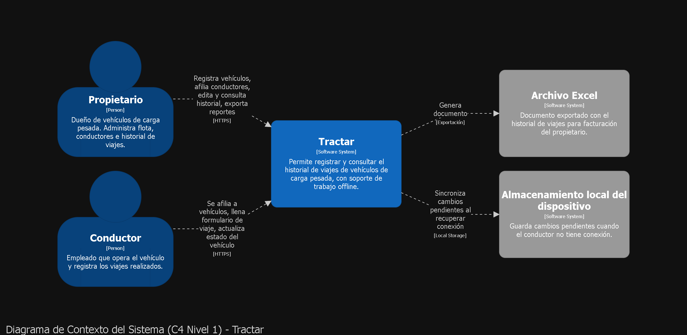

# 

**About arc42**

arc42, the template for documentation of software and system
architecture.

Template Version 9.0-EN. (based upon AsciiDoc version), July 2025

Created, maintained and © by Dr. Peter Hruschka, Dr. Gernot Starke and
contributors. See <https://arc42.org>.

# Introduction and Goals

## Requirements Overview

Tractar es un sistema web dirigido al gremio de camioneros de Cartagena. Resuelve un problema
concreto: hoy el registro de viajes de carga pesada se hace en papel, el conductor se lo entrega
al propietario y este transcribe manualmente los datos para llevar historial y facturar. Ese
proceso consume entre 1 y 2 horas por viaje y depende de que el papel no se pierda ni se dañe.

Tractar reemplaza ese flujo por una aplicación web donde propietarios y conductores registran los
viajes directamente, con soporte para seguir trabajando sin conexión y sincronizar los cambios
cuando el dispositivo recupera internet.

El sistema está dirigido principalmente a propietarios independientes (no a grandes empresas de
transporte todavía).

## Quality Goals

Los objetivos de calidad se priorizaron a partir de las entrevistas con propietarios y de las
condiciones reales de trabajo del conductor (en ruta, con conectividad intermitente, muchas veces
usando un teléfono de gama baja que le entrega el propietario).

| # | Objetivo de calidad | Motivación |
|---|---|---|
| 1 | **Disponibilidad** | El conductor debe poder registrar el viaje apenas termina, no varias horas después. |
| 2 | **Usabilidad** | Los usuarios (incluyendo adultos mayores) tienen conocimiento tecnológico limitado. |
| 3 | **Seguridad** | El historial de viajes es información financiera sensible; solo el propietario debe verla completa. |
| 4 | **Rendimiento** | El sistema debe responder rápido incluso en dispositivos de gama baja y con muchos usuarios a la vez. |
| 5 | **Portabilidad** | Debe funcionar en el rango real de dispositivos que usan los conductores (Android 8+, 2GB RAM). |

Estos cinco objetivos son la base del árbol de utilidad (sección 10).

## Stakeholders

| Role/Name | Contact | Expectations |
|--------------|-----------------|---------------------|
| **Propietario** | Dueño de uno o más vehículos de carga pesada | Llevar el historial completo de sus vehículos, controlar quién edita qué, facturar rápido |
| **Conductor** | Empleado contratado para manejar el vehículo | Registrar el viaje de forma simple, sin depender de tener internet en el momento |
| **Equipo de desarrollo** | Sebastián García, Gerónimo Cadena, Joriel Samir Barros, Mateo Milán | Construir un sistema mantenible dentro del tiempo del semestre |
| **Docente / evaluador** | Profesor del curso | Verificar que la arquitectura documentada corresponda con lo implementado en el repositorio |

# Architecture Constraints

Cada restricción se documenta con su justificación: de dónde sale y qué implica para el diseño.
No son preferencias del equipo, son condiciones que ya vienen dadas y que la arquitectura tiene
que respetar.

**Restricciones técnicas**

| Restricción | Origen | Implicación arquitectónica |
|---|---|---|
| Interfaz web construida con HTML y base de datos MySQL | Definida por el curso / recursos disponibles del equipo | El backend debe exponer una API consumible desde un frontend web estándar; el modelo de datos se diseña sobre un motor relacional |
| Solo pueden usarse las librerías/herramientas dadas por el profesor | Condición del curso | Limita las opciones de frameworks; hay que validar cada dependencia antes de adoptarla |
| Compatibilidad con Android 8 en adelante, mínimo 2GB de RAM | Los conductores usan smartphones de gama baja que muchas veces les entrega el propietario | El cliente no puede ser una app pesada; se prioriza una web app ligera en vez de nativa, y hay que evitar librerías de frontend que consuman mucha memoria |
| Debe funcionar sin conexión y sincronizar al recuperar internet | El conductor está en ruta, con conectividad intermitente (RNF derivado del alcance del producto) | Obliga a un patrón de almacenamiento local en el cliente + sincronización diferida, en vez de un modelo que asuma conexión permanente |

**Restricciones organizacionales**

| Restricción | Origen | Implicación arquitectónica |
|---|---|---|
| El proyecto debe estar terminado dentro del semestre académico | Calendario del curso | Favorece una arquitectura simple y modular sobre una solución sobre-diseñada; no hay tiempo para reescrituras grandes |
| Equipo de 4 personas, todas simultáneamente estudiantes de otras materias | Composición real del equipo | La arquitectura debe permitir trabajo en paralelo sin choques constantes (separación clara de módulos/responsabilidades) |

**Restricciones legales / normativas**

| Restricción | Origen | Implicación arquitectónica |
|---|---|---|
| Cumplimiento de la Ley de Protección de Datos Personales (Ley 1581 de 2012, Colombia) | Los usuarios registran datos personales (nombre, contacto, contraseña) y datos financieros de sus viajes | Las contraseñas deben resguardarse cifradas/hasheadas, y el acceso a los datos finales de facturación debe restringirse solo al propietario correspondiente (no a otros propietarios ni a conductores) |

# Context and Scope

## Business Context

Tractar se sitúa entre dos roles humanos que hoy se comunican en papel: el **propietario** del
vehículo y el **conductor** que lo opera. El sistema reemplaza ese intercambio físico por
registro digital directo de cada uno.

| Comunicación | Descripción | Formato / canal |
|---|---|---|
| Propietario → Tractar | Crea vehículos, afilia/desvincula conductores, define datos guía (trayectos y valores frecuentes), edita y bloquea formularios, marca viajes como pagados/no pagados, exporta historial | Interfaz web, HTTPS |
| Conductor → Tractar | Se afilia a un vehículo (con confirmación del propietario), llena el formulario de cada viaje, actualiza el estado del vehículo | Interfaz web/móvil, HTTPS, con cola local si no hay conexión |
| Tractar → Archivo Excel | Genera el documento de historial para que el propietario facture | Exportación bajo demanda |

No hay integración con sistemas externos de terceros (por ejemplo, pasarelas de pago o sistemas
de otras empresas): el alcance actual es interno entre estos dos roles y el propio sistema.

## Technical Context

El conductor accede normalmente desde un smartphone de gama baja/media, muchas veces sin conexión
constante; el propietario accede típicamente desde un navegador de escritorio o móvil con mejor
conectividad. Esta diferencia es la que obliga al sistema a soportar edición offline en el lado
del conductor.

**Diagrama de contexto (C4 Nivel 1)**



*(Diagrama modelado en Structurizr a partir de `workspace.dsl`. Muestra Propietario y Conductor
como actores, Tractar como sistema central, y dos sistemas externos: el archivo Excel exportado
y el almacenamiento local del dispositivo usado para sincronización offline.)*

# Solution Strategy

Esta sección resume las decisiones tecnológicas y de estilo que atraviesan todo el sistema, y
por qué se tomaron — el detalle completo de cada una vive en su propio ADR bajo `docs/adr/`.

## Decisiones tecnológicas

| Decisión | Motivación |
|---|---|
| Backend en Django (Python) | Ya lo maneja el equipo, cumple la restricción de "herramientas dadas por el profesor", y su convención de *apps* encaja de forma natural con un estilo modular sin pelear contra el framework |
| Persistencia en MySQL | Restricción técnica directa (sección 2.1) |
| Frontend en HTML servido por el propio backend (sin framework de SPA separado) | Restricción técnica directa; además reduce la superficie de trabajo para un equipo de 4 en un semestre |

## Decisión de estilo arquitectónico

Se eligió **Monolito Modular**: un único desplegable dividido internamente en módulos de
dominio independientes (`usuarios`, `vehículos`, `viajes`, `facturación`).

La comparación completa contra los otros dos estilos evaluados (capas y hexagonal) está en
[`docs/matriz_estilos.md`](../matriz_estilos.md), y la decisión formal con alternativas
descartadas y consecuencias en
[`docs/adr/0001-estilo-arquitectonico.md`](../adr/0001-estilo-arquitectonico.md) (**ADR-0001**).

En resumen: se descartó *capas* porque la sincronización offline (escenario QS-01) atraviesa
las tres capas técnicas a la vez, y se descartó *hexagonal* porque el costo de sostener
puertos y adaptadores no es realista para un equipo de 4 estudiantes en un semestre. El
monolito modular es el que menos compromisos rotos deja contra las restricciones de la
sección 2 y los escenarios de calidad de la sección 10.

## Cómo se logran los objetivos de calidad principales

| Objetivo de calidad | Enfoque de solución |
|---|---|
| Disponibilidad / offline (QS-01) | Encapsulado dentro del módulo que lo necesita, no disperso en capas técnicas (ver ADR-0001) |
| Usabilidad (QS-05) | Menos tiempo invertido en indirección arquitectónica = más tiempo para el formulario simple |
| Seguridad (QS-04) | Autorización a nivel de módulo `facturacion`, contraseñas con hash (Django lo provee por defecto) |
| Rendimiento (QS-02, QS-03) | Pendiente de detallar en Building Block View (S4/S6); no se resuelve con el estilo, se resuelve con decisiones de infraestructura posteriores |

# Building Block View

## Whitebox Overall System

***\<Overview Diagram\>***

Motivation  
*\<text explanation\>*

Contained Building Blocks  
*\<Description of contained building block (black boxes)\>*

Important Interfaces  
*\<Description of important interfaces\>*

### \<Name black box 1\>

*\<Purpose/Responsibility\>*

*\<Interface(s)\>*

*\<(Optional) Quality/Performance Characteristics\>*

*\<(Optional) Directory/File Location\>*

*\<(Optional) Fulfilled Requirements\>*

*\<(optional) Open Issues/Problems/Risks\>*

### \<Name black box 2\>

*\<black box template\>*

### \<Name black box n\>

*\<black box template\>*

### \<Name interface 1\>

…

### \<Name interface m\>

## Level 2

### White Box *\<building block 1\>*

*\<white box template\>*

### White Box *\<building block 2\>*

*\<white box template\>*

…

### White Box *\<building block m\>*

*\<white box template\>*

## Level 3

### White Box \<\_building block x.1\_\>

*\<white box template\>*

### White Box \<\_building block x.2\_\>

*\<white box template\>*

### White Box \<\_building block y.1\_\>

*\<white box template\>*

# Runtime View

## \<Runtime Scenario 1\>

- *\<insert runtime diagram or textual description of the scenario\>*
- *\<insert description of the notable aspects of the interactions
  between the building block instances depicted in this diagram.\>*

## \<Runtime Scenario 2\>

## …

## \<Runtime Scenario n\>

# Deployment View

## Infrastructure Level 1

***\<Overview Diagram\>***

Motivation  
*\<explanation in text form\>*

Quality and/or Performance Features  
*\<explanation in text form\>*

Mapping of Building Blocks to Infrastructure  
*\<description of the mapping\>*

## Infrastructure Level 2

### *\<Infrastructure Element 1\>*

*\<diagram + explanation\>*

### *\<Infrastructure Element 2\>*

*\<diagram + explanation\>*

…

### *\<Infrastructure Element n\>*

*\<diagram + explanation\>*

# Cross-cutting Concepts

## *\<Concept 1\>*

*\<explanation\>*

## *\<Concept 2\>*

*\<explanation\>*

…

## *\<Concept n\>*

*\<explanation\>*

# Architecture Decisions

Las decisiones de arquitectura se documentan como ADR individuales en `docs/adr/`, no en esta
sección. Índice de decisiones tomadas hasta ahora:

- [ADR-0001](../adr/0001-estilo-arquitectonico.md) — Estilo arquitectónico: Monolito Modular (S3)

# Quality Requirements

## Quality Requirements Overview

El árbol parte de los cinco objetivos de calidad definidos en la sección "Quality Goals". Cada
rama se desglosa en atributos concretos y se prioriza con dos ejes: **importancia para el
negocio** y **dificultad técnica de lograrlo** (Alta/Media/Baja, Alta/Media/Baja).

```
Utilidad (Tractar)
│
├── Disponibilidad
│   └── Sistema accesible en horario laboral del conductor (7am-10pm)      [Alta / Media]
│
├── Rendimiento
│   ├── Tiempo de carga de la interfaz                                     [Alta / Media]
│   └── Soporte de usuarios concurrentes                                   [Alta / Alta]
│
├── Seguridad
│   ├── Protección de contraseñas                                         [Alta / Baja]
│   └── Confidencialidad de datos de facturación entre propietarios       [Alta / Media]
│
├── Usabilidad
│   └── Formulario de viaje utilizable por adultos mayores / poco expertos [Alta / Media]
│
└── Portabilidad
    └── Funcionamiento en dispositivos de gama baja (Android 8+, 2GB RAM)  [Media / Media]
```

## Quality Scenarios

Se documentan 5 escenarios, uno por rama principal del árbol, en formato
Fuente–Estímulo–Ambiente–Artefacto–Respuesta–Medida (SEI). Cada uno está enlazado desde su
aspecto correspondiente en `docs/aspectos.md`.

### QS-01 — Disponibilidad

*(Motiva [ADR-0001](../adr/0001-estilo-arquitectonico.md) — ver Solution Strategy)*

| Campo | Descripción |
|---|---|
| **Fuente** | Conductor o propietario |
| **Estímulo** | Intenta acceder al sistema |
| **Ambiente** | Horario laboral habitual (7:00 a.m. – 10:00 p.m.) |
| **Artefacto** | Servicio web de Tractar |
| **Respuesta** | El sistema atiende la solicitud sin caída del servicio |
| **Medida** | Disponibilidad ≥ 99% del tiempo dentro de la ventana 7am–10pm |

### QS-02 — Rendimiento (tiempo de respuesta)

| Campo | Descripción |
|---|---|
| **Fuente** | Usuario (propietario o conductor) |
| **Estímulo** | Abre la aplicación o navega a una nueva vista |
| **Ambiente** | Operación normal, dispositivo de gama baja (2GB RAM) |
| **Artefacto** | Interfaz web de Tractar |
| **Respuesta** | La vista carga y queda interactiva |
| **Medida** | Tiempo de carga ≤ 3 segundos |

### QS-03 — Rendimiento (concurrencia)

| Campo | Descripción |
|---|---|
| **Fuente** | Conjunto de usuarios del sistema |
| **Estímulo** | Múltiples usuarios usan el sistema al mismo tiempo (hora pico) |
| **Ambiente** | Operación normal |
| **Artefacto** | Backend / API de Tractar |
| **Respuesta** | El sistema procesa las solicitudes sin degradar el servicio |
| **Medida** | Soporta al menos 300 usuarios simultáneos sin errores ni caídas |

### QS-04 — Seguridad

| Campo | Descripción |
|---|---|
| **Fuente** | Propietario distinto al dueño de los datos, o atacante externo |
| **Estímulo** | Intenta acceder al historial de facturación de un vehículo que no le pertenece |
| **Ambiente** | Operación normal del sistema |
| **Artefacto** | Módulo de autorización / datos de facturación |
| **Respuesta** | El sistema deniega el acceso y no expone la información |
| **Medida** | 0% de solicitudes no autorizadas exitosas; contraseñas almacenadas con hash (nunca en texto plano) |

### QS-05 — Usabilidad

*(Motiva [ADR-0001](../adr/0001-estilo-arquitectonico.md) — ver Solution Strategy)*

| Campo | Descripción |
|---|---|
| **Fuente** | Conductor con conocimiento tecnológico limitado (incluye adultos mayores) |
| **Estímulo** | Debe registrar un viaje nuevo por primera vez, sin capacitación previa |
| **Ambiente** | Uso normal en campo |
| **Artefacto** | Formulario de registro de viaje |
| **Respuesta** | El usuario completa el formulario correctamente |
| **Medida** | Completa el registro en ≤ 3 intentos y en menos de 2 minutos, sin asistencia externa |

# Risks and Technical Debts

# Glossary

| Term | Definition |
|--------------|--------------------|
| *\<Term-1\>* | *\<definition-1\>* |
| *\<Term-2\>* | *\<definition-2\>* |
