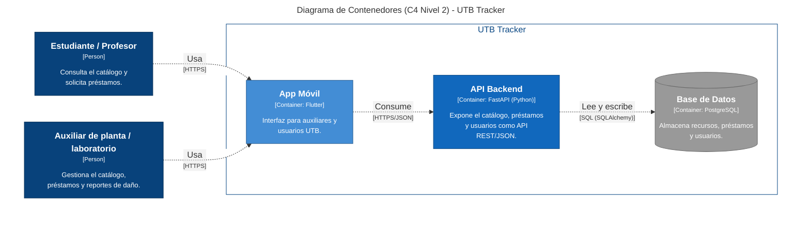

# Diagrama de Contenedores (C4 - Nivel 2) - UTB Tracker

Los tres contenedores corresponden 1 a 1 con lo que existe en el repositorio: `App Móvil`
(proyecto Flutter, en su propio repo/carpeta), `API Backend` (carpeta `app/` de este repo,
FastAPI) y `Base de Datos` (PostgreSQL en despliegue, SQLite en desarrollo/CI — ver
`app/database.py`).

