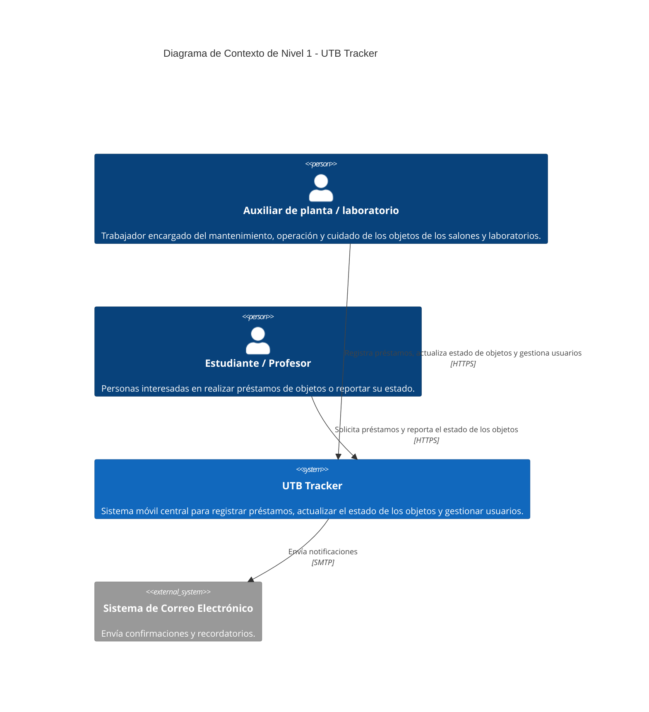

# Diagrama de Contexto (C4 - Nivel 1) - UTB Tracker

```mermaid
C4Context
    title Diagrama de Contexto de Nivel 1 - UTB Tracker

    Person(auxiliar, "Auxiliar de planta / laboratorio", "Trabajador encargado del mantenimiento, operación y cuidado de los objetos de los salones y laboratorios.")
    Person(usuarioUTB, "Estudiante / Profesor", "Personas interesadas en realizar préstamos de objetos o reportar su estado.")
    
    System(utbTracker, "UTB Tracker", "Sistema móvil central para registrar préstamos, actualizar el estado de los objetos y gestionar usuarios.")
    System_Ext(sistemaCorreo, "Sistema de Correo Electrónico", "Envía confirmaciones y recordatorios.")

    Rel(auxiliar, utbTracker, "Registra préstamos, actualiza estado de objetos y gestiona usuarios", "HTTPS")
    Rel(usuarioUTB, utbTracker, "Solicita préstamos y reporta el estado de los objetos", "HTTPS")
    Rel(utbTracker, sistemaCorreo, "Envía notificaciones", "SMTP")

    UpdateElementStyle(auxiliar, $bgColor="#08427b", $fontColor="#ffffff", $borderColor="#052e56")
    UpdateElementStyle(usuarioUTB, $bgColor="#08427b", $fontColor="#ffffff", $borderColor="#052e56")
    UpdateElementStyle(utbTracker, $bgColor="#1168bd", $fontColor="#ffffff", $borderColor="#0b4884")
    UpdateElementStyle(sistemaCorreo, $bgColor="#999999", $fontColor="#ffffff", $borderColor="#6b6b6b")

    UpdateLayoutConfig($c4ShapeInRow="3", $c4BoundaryInRow="1")
```